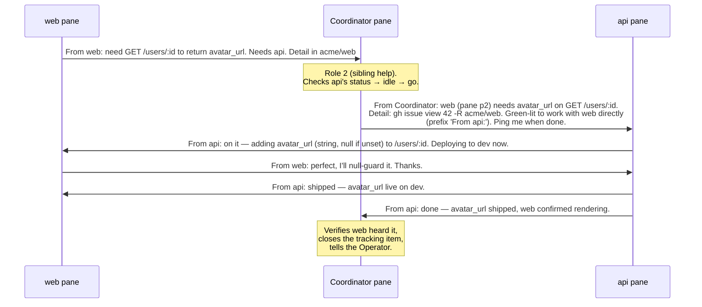

# Worked example — a Coordinator + two projects, end to end

This walks a brand-new herdr run from empty to a working three-pane setup where a **Coordinator**
brokers two projects — **`api`** (a backend) and **`web`** (a frontend) — and shows one real
coordination round-trip with the actual messages that cross the panes.

Names here are illustrative: umbrella `acme`, apps `api` and `web`. Swap in your own.

## 0. The shape we're building

```
~/acme/                         ← workspace root; the COORDINATOR pane runs here
├── .claude/skills/
│   ├── cross-coordinate/       ← coordinator/cross-coordinate  (from this template)
│   └── set-workspace/          ← coordinator/set-workspace
├── api/                        ← project A; the "api" pane runs here (cwd = ~/acme/api)
│   └── .claude/skills/cross-coordinate/    ← child/cross-coordinate, {AppName}=api
└── web/                        ← project B; the "web" pane runs here (cwd = ~/acme/web)
    └── .claude/skills/cross-coordinate/    ← child/cross-coordinate, {AppName}=web
```

Three panes, one Claude each. The Coordinator owns no project — it sits at the root and routes.
Each child pane's **cwd is its own project dir**; that's how `set-workspace` identifies them.

## 1. Get the template

```bash
git clone https://github.com/RoninATX/Bootstraps.git ~/tmp/bootstraps
TPL=~/tmp/bootstraps/herdr
```

## 2. Install the Coordinator skills (at the workspace root)

```bash
mkdir -p ~/acme/.claude/skills
cp -r "$TPL/coordinator/cross-coordinate" ~/acme/.claude/skills/
cp -r "$TPL/coordinator/set-workspace"    ~/acme/.claude/skills/
```

Fill the placeholders in both files. There are only a handful:

| Placeholder        | This example becomes |
|--------------------|----------------------|
| `{workspace-root}` | `~/acme` (use the absolute path) |
| `{AppA}` / `{AppB}`| `api` / `web` |
| `{StackName}`      | `Acme` (or just delete the mention) |
| `{tracker}`        | `gh issue` — or delete the tracking sections if you don't use one |
| `{status-cmd}`     | delete Step 4 of `set-workspace` if you have no "what's next" command |
| `<ColorA>`/`<ColorB>` | pick two distinct herdr/Claude colors, e.g. `Blue` / `Green` |

A quick sed pass covers the mechanical ones (do the judgment ones — tracker/status — by hand):

```bash
cd ~/acme/.claude/skills
sed -i 's#{workspace-root}#'"$HOME"'/acme#g; s/{AppA}/api/g; s/{AppB}/web/g; s/{StackName}/Acme/g' \
  cross-coordinate/SKILL.md set-workspace/SKILL.md
```

## 3. Install the child skill in each project (with its own identity)

Same template file, but `{AppName}` is set to *that* project, and `{SiblingApp}` to the other one.

```bash
for app in api web; do
  mkdir -p ~/acme/$app/.claude/skills
  cp -r "$TPL/child/cross-coordinate" ~/acme/$app/.claude/skills/
done

# api's copy: it is "api", its sibling is "web"
sed -i 's/{AppName}/api/g; s/{SiblingApp}/web/g; s/{SiblingA}/web/g; s#{workspace-root}#'"$HOME"'/acme#g' \
  ~/acme/api/.claude/skills/cross-coordinate/SKILL.md

# web's copy: it is "web", its sibling is "api"
sed -i 's/{AppName}/web/g; s/{SiblingApp}/api/g; s/{SiblingA}/api/g; s#{workspace-root}#'"$HOME"'/acme#g' \
  ~/acme/web/.claude/skills/cross-coordinate/SKILL.md
```

> With more than two projects, `{SiblingApp}` is just "any sibling" — the label on an incoming
> `From <App>:` turn tells the pane which one. Leave it reading generically, or list the concrete
> names in prose; the protocol doesn't care how many siblings there are.

## 4. Bring up the three panes in herdr

In one herdr tab, create three panes and start a Claude in each, one per cwd:

- **pane 1** — cwd `~/acme`      → the **Coordinator**
- **pane 2** — cwd `~/acme/api`  → **api**
- **pane 3** — cwd `~/acme/web`  → **web**

(Split via the herdr UI or its pane/tab commands; the only thing that matters is each pane's cwd
and that a Claude session is running in it. Every skill checks `HERDR_ENV=1`, which herdr sets
inside managed panes.)

## 5. Hydrate the workspace from the Coordinator

In the **Coordinator** pane:

```
set workspace
```

`set-workspace` discovers the three panes by cwd basename, evens the `api`/`web` stack, renames
each herdr pane, drives each child through `/rename` · `/color` · `/rc`, and (if you kept Step 4)
polls each for what's on its radar. You now have a labeled, remote-controllable three-pane board.

## 6. A real coordination round-trip

**Scenario:** `web` is building a profile page and needs the backend to return an avatar URL.
That's a cross-app contract change — exactly what the protocol is for.

The message classes in play: an **unlabeled** turn is the Operator (you); **`From Coordinator:`**
is the router; **`From api:` / `From web:`** are the projects speaking as themselves.



Step by step, and *which skill fires when*:

1. **web raises the ask (child `cross-coordinate`, outbound).** web opens a tracking item
   (`gh issue` #42 with the contract detail), then injects **one line** into the Coordinator's
   pane — never straight to `api`:
   > `From web: need GET /users/:id to return avatar_url so the profile page can render it. Needs api. Detail in acme/web#42.`

   Then it **stops reaching toward api** and does what web-side work it can while it waits.

2. **Coordinator receives + routes (coordinator `cross-coordinate`).** The `From web:` prefix is
   the trigger. It's a request for *another project's hands* → Role 2. The Coordinator resolves
   the `api` pane and checks interruptibility (`herdr agent list` + read the pane):
   - **api idle** → relay now (next step).
   - **api mid-task / asking a permission question** → *don't interrupt.* Buffer it, tell the
     Operator "web needs api but api looks busy — holding," and wait for the Operator's
     "now's a good time" before relaying. (Here: api is idle, so it proceeds.)

3. **Coordinator green-lights api.** One `From Coordinator:` line into the api pane carrying the
   five things the skill requires — who wants help + their pane, the one-line ask, a *resolvable*
   pointer to the detail (`gh issue view 42 -R acme/web`, not a bare `#42`), the green light to
   work with web directly, and "ping me back when done":
   > `From Coordinator: web (pane p2) needs GET /users/:id to return avatar_url. Detail: gh issue view 42 -R acme/web. You're green-lit to work with web directly — reach into their pane and prefix your messages 'From api:'. Ping me back here when it's done.`

4. **api and web work pane-to-pane (child `cross-coordinate`, inbound + direct).** api recognizes
   `From Coordinator:` as the router (not the Operator), does the work, and talks to web directly —
   every message labeled `From api:`. web answers `From web:`. The Coordinator is out of the loop
   for the actual back-and-forth.

5. **Close-out.** api finishes, sends web the direct close (`From api: shipped…`), **and** reports
   up (`From api: done…`). The Coordinator confirms web actually heard the good news (if api had
   skipped the direct close, the Coordinator relays the unblock itself), closes the tracking item,
   and tells you — the Operator — it's resolved.

### No tracker? Same flow, detail moves inline

If you skipped `{tracker}`, drop the "Detail in #42" pointer and put the couple of specifics in the
relay itself:

> `From web: need GET /users/:id to return avatar_url (string, null if unset) for the profile page. Needs api.`

The one-line discipline loosens slightly, but the routing, the labels, and the green-light gate are
identical.

## What to take away

- **Everything routes through the Coordinator to *start*.** Children never cold-poke each other.
- **The label is the whole protocol.** `From X:` = a project; `From Coordinator:` = the router;
  no prefix = you. Get the three classes right and the rest follows.
- **The Coordinator's real job is timing** — protecting a busy pane from interruption and handing
  off only when it's safe, escalating to you when it's murky.
- **It scales past two.** Add `project C`, install the child skill with `{AppName}=projC`, and it
  joins the same board — no change to the others.
